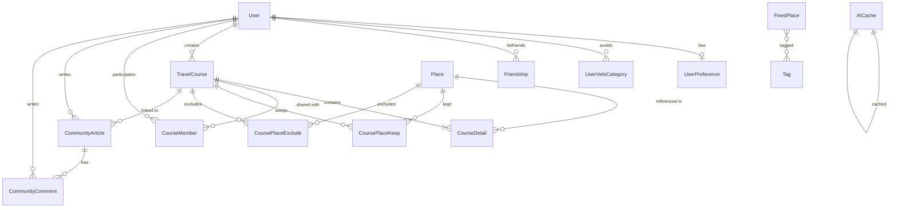

# 13-pjt: AI 기반 추천 서비스 (여행 코스 자동 기획 서비스)

## 1. 프로젝트 개요 (Project Overview) 및 기획 의도

본 프로젝트는 **"생성형 AI(Gemini)와 외부 API(Kakao, Naver)를 결합한 하이브리드 동적 여행 코스 추천 시스템"**입니다.

**[기획 의도]**
기존의 여행 추천 서비스들은 AI가 일방적으로 전체 코스를 던져주어 취향에 맞지 않거나, 반대로 사용자가 처음부터 끝까지 수동으로 경로를 찾아 편집해야 하는 양극단의 번거로움이 있었습니다. 본 프로젝트는 이러한 '계획 피로도'를 해결하기 위해 기획되었습니다. 
AI가 뼈대(Blueprint)를 스케줄링해주되, 사용자가 마음에 드는 장소는 고정(Lock)하고 마음에 들지 않는 일정만 즉각적으로 재조합(Spin)할 수 있는 **"부분 편집권"**을 제공합니다. 이를 통해 사용자는 계획의 피로감을 줄이면서도 여행 기획의 주도권과 탐색의 재미를 잃지 않을 수 있습니다.

---

## 2. 구현 과정 및 회고 (학습 내용, 어려웠던 점, 새로 배운 것들 및 느낀 점)

프로젝트를 진행하며 팀 차원에서 기술적 성장과 더불어 기획 및 개발 방법론에 대한 깊은 고찰이 있었습니다.

* **기획의 중요성과 애자일(Agile)한 대응의 필요성 체감**
  * **어려웠던 점**: 자율 주제로 프로젝트를 시작하다 보니, 초기 기획 단계에서 완벽하게 확정하지 못했던 디테일들이 개발 도중 구체화되는 경우가 많았습니다. 특히 'Lock & Spin'이라는 동적 기능을 구현하면서 예외 처리나 상태 동기화 로직이 당초 예상보다 복잡해져 개발 후반부에 일정의 촉박함을 느꼈습니다.
  * **느낀 점**: 탄탄한 초기 기획과 산출물 정의가 프로젝트의 안정성에 얼마나 큰 영향을 미치는지 깊게 체감했습니다. 하지만 한편으로는 자율 주제의 특성상 개발 과정에서의 유연한 요구사항 변경과 대응은 불가피하며, 이를 조율해 나가는 과정 자체가 실무적인 프로젝트 관리 역량을 기르는 좋은 경험이 되었습니다.

* **AI Agent를 활용한 개발 패러다임의 변화와 경계 (학습 내용 및 새로 배운 것)**
  * **학습 내용 및 새로 배운 것**: 과거에는 막히는 부분이 있을 때 구글링이나 스택오버플로우에 의존하여 단편적인 코드를 복사하는 수준이었다면, 이번 프로젝트에서는 코딩 AI Agent를 적극적으로 도입해 보았습니다. 그 결과, 단순 문법 오류 해결을 넘어 전반적인 아키텍처 기획, Django REST Framework 모델 뷰셋 커스텀, Vue 3 & Pinia 상태 관리의 흐름 구성, 그리고 복잡한 글래스모피즘(Glassmorphism) UI 구현에 이르기까지 깊이 있고 폭넓은 기술 스택을 새로 학습하고 적용할 수 있었습니다.
  * **느낀 점**: AI가 기획부터 구현, QA(익명 사용자 예외 처리 등)까지 전방위적인 도움을 주었으나, 앞으로 이를 스마트하게 사용하기 위해서는 개발자 본인이 로직의 흐름을 명확히 이해하고 통제할 수 있어야 함을 깨달았습니다. AI의 제안에 무비판적으로 너무 의존해서는 안 되며, 주도적인 설계 능력이 동반되어야 한다는 귀중한 교훈을 얻었습니다.

---

## 3. 팀원 정보 및 업무 분담 내역

기획부터 구현까지 2인 체제로 진행되었으며, 각자의 강점을 살려 프론트엔드와 백엔드 영역을 깊이 있게 분담 및 협업하였습니다.

| 이름 | 역할 | 세부 업무 분담 내역 |
| :---: | :---: | :--- |
| **팀장 (본인 이름)** | 풀스택 및 아키텍처 리드 | - **기획 및 요구사항 정의**: 팀원과 공동 수행 - **DB 모델링 및 아키텍처 설계**: 초기 프로토타입 설계 및 기반 구축 - **백엔드**: Django REST Framework 기반 API 서버 로직 전면 구축 - **AI 엔지니어링**: 팀원의 프로토타입을 바탕으로 Gemini 연동 로직 고도화 및 프롬프트 엔지니어링 최적화 - **UI/UX 개발**: UI 프로토타입 작성 후, 팀원의 Figma 산출물을 글래스모피즘 코드로 최종 적용 - **프론트엔드 아키텍처**: Vue 3 & Pinia 상태 관리 아키텍처 설계 및 구축 - **API 시각화**: Kakao Map API를 활용한 동적 지도 시각화 연동 - **소셜/라우팅**: 소셜 기능(친구 맺기, 커뮤니티 쓰레드) 프론트엔드 연동, 비회원 접근 및 예외 처리(404 등) 라우팅 구현 |
| **팀원 (팀원 이름)** | 외부 연동 및 UI/DB 고도화 | - **기획 및 요구사항 정의**: 팀장과 공동 수행 - **DB 모델링 보완**: 팀장의 프로토타입을 바탕으로 관계형 모델링 정교화 및 DB 최종 완성 - **AI 엔지니어링**: 생성형 AI(Gemini) 연동 관련 초기 프로토타입 구현 - **외부 API 파이프라인**: Kakao/Naver API 기반 데이터 수집 자동화 로직 구현 - **UI/UX 디자인**: 팀장의 프로토타입을 바탕으로 Figma를 활용한 디자인 시스템 및 뷰 고도화 설계 |

---

## 4. 목표 서비스 및 실제 구현 정도 (100% 달성)

본 프로젝트의 궁극적인 목표는 "단순히 예쁜 여행지를 나열하는 것이 아니라, 사용자가 겪는 일정 기획의 번거로움을 실질적으로 해소하여 '당장 떠날 수 있는' 실현 가능한 코스를 제공하는 것"이었습니다.

**[목표 대비 실제 구현 상세]**
1. **맥락 기반 AI 스케줄링 및 부분 편집 (구현 완료)**
   - **기획 의도**: 전체 일정을 수동으로 짜는 피로감을 AI로 덜어주고, 동시에 마음에 들지 않는 부분만 핀포인트로 수정할 수 있게 하여 유저의 주도권을 보장합니다.
   - **구현**: 사용자의 프롬프트를 AI가 분석해 시간대별(Slot) 가장 적합한 카테고리를 도출하여 코스를 생성하며, Lock & Spin 기능을 통해 특정 슬롯만 독립적으로 재구성(Re-spin)할 수 있는 로직을 완벽히 구현했습니다.
2. **소통과 공유의 소셜 플랫폼 화 (구현 완료)**
   - **기획 의도**: 여행 코스는 본인뿐만 아니라 동행자나 타인과 공유될 때 가치가 극대화되므로, 고립된 유틸리티 툴이 아닌 소셜 플랫폼으로 확장하고자 했습니다.
   - **구현**: Vue.js 단에서 Pinia를 이용해 `friend.js` 상태 관리를 구축하여 친구 요청/수락 흐름을 완성했으며, 작성된 코스를 커뮤니티 게시판과 연동해 유저 간 댓글로 소통할 수 있도록 구현했습니다.
3. **UX 중심의 진입 장벽 최소화 (구현 완료)**
   - **기획 의도**: 로그인 없이도 AI의 강력한 기획 기능을 먼저 체험하게 하여(Try-Before-You-Buy) 서비스의 진가를 보여주고 자연스러운 가입을 유도합니다.
   - **구현**: 비회원(`AnonymousUser`)도 즉각적으로 AI 코스 기획 및 스핀 기능을 체험할 수 있도록 권한 필터를 커스텀했습니다. 비회원의 코스는 `user__isnull=True` 상태로 DB에 안전하게 임시 보관되며, 가입 시 본인 소유로 즉시 귀속(`claim`)됩니다.

---

## 5. 데이터베이스 모델링 (ERD)

프로젝트의 유연한 소셜 확장과 다이나믹한 일정 관리를 고려하여 관계형 데이터베이스(RDBMS)를 정교하게 모델링하였습니다.

**[핵심 모델링 주안점]**
- `Place` 모델과 `TravelCourse` 모델 사이에 `CourseDetail` 모델을 중간 테이블(Slot 개념)로 설계하여, 하나의 코스가 여러 시간대별 장소를 시계열적으로 가질 수 있는 다대다(N:M) 구조를 유연하게 풀어냈습니다.
- 추천 제외 및 유지 관리를 위해 `CoursePlaceExclude`와 `CoursePlaceKeep` 테이블을 추가하여 Re-spin 시 배제 로직을 쿼리 수준에서 최적화했습니다.
- 외부 API 통신의 과부하를 막기 위해 `FixedPlace`, `TemporaryEvent`, `AICache` 테이블을 두어 AI의 응답과 Kakao/Naver 데이터를 내부 캐싱하도록 설계했습니다.
- 유저 간의 관계는 `Friendship` 테이블을 통한 자기참조(Self-referential) 기반 M:N 관계로 구현하였으며, `CommunityArticle`과 `CommunityComment`를 통해 커뮤니티 게시판의 구조를 완성했습니다.

---

## 6. 추천 알고리즘에 대한 기술적 설명

AI의 환각 현상(Hallucination - 존재하지 않는 식당이나 명소를 지어내는 현상)을 막기 위해 **[AI 프롬프팅 + 외부 API 실시간 수집 + 내부 스코어링 엔진]**의 3단계 하이브리드 아키텍처를 자체 고안하여 적용했습니다.

1. **지능형 키워드 추출 (Intent Analysis)**: AI는 식당 이름 등을 지어내지 않고, 사용자의 요청을 분석해 `[지역명 + '분위기 좋은', '한식']`과 같이 검색 시스템이 이해할 수 있는 형태의 태그와 카테고리만 구조화하여 백엔드에 넘깁니다.
2. **실시간 데이터 캐싱 (On-the-fly Fetching)**: 도출된 태그를 기반으로 내부 DB를 우선 조회합니다. 조건에 부합하는 장소가 부족하다면, Kakao Local API와 Naver Search API를 즉시 호출하여 최신 실존 장소(음식점, 전시, 팝업 행사 등) 데이터를 확보하고 DB에 캐싱합니다.
3. **다차원 스코어링 엔진 (Dynamic Scoring)**: 확보된 데이터 후보군(`fresh_candidates`)을 대상으로 다음 3가지 핵심 가중치를 계산하여 1위 장소를 최종 슬롯에 배정합니다.
   - **사용자 선호도(Theme Match)**: 유저가 사전에 설정한 취향(예: 힐링, 액티비티)과 장소의 태그가 일치할 시 가점 부여.
   - **동선 최적화(Distance Penalty)**: 직전 스케줄 장소(Anchor)와의 좌표상 거리를 하버사인(Haversine) 공식으로 계산하여, 동선이 비현실적으로 튀는 장소는 스코어를 대폭 감점 처리.
   - **블랙리스트 필터링(Veto)**: 유저가 명시적으로 기피하는 카테고리(해산물, 액티비티 등)는 Django ORM의 `exclude()` 구문을 활용하여 쿼리 단에서 원천 배제.

---

## 7. 핵심 기능에 대한 설명

본 프로젝트의 평가 주안점이 될 4대 핵심 기능은 다음과 같습니다.

1. **AI 기반 타임라인 자동 스케줄링**: 
   - 여행 일자와 이동 수단, 취향 프롬프트를 텍스트로 가볍게 입력하면, 오전 9시부터 시간 단위의 일정(Slot)을 타임라인 형태로 자동 생성하여 반환합니다.
2. **장소 고정(Lock) 및 룰렛 재추천(Spin) 기능**: 
   - 사용자가 전체 타임라인 중 마음에 드는 장소는 자물쇠 아이콘(Lock)을 클릭해 확정 지을 수 있습니다.
   - 마음에 들지 않는 장소는 **Spin 버튼**을 클릭하면, 해당 장소만 배제(`CoursePlaceExclude`)한 채 스코어링 엔진을 재가동하여 새로운 주변 최적 장소로 즉시 교체해 줍니다. 
3. **글래스모피즘 기반의 동적 지도 시각화 (Interactive Map)**:
   - Kakao Map API를 활용하여, 타임라인에 배정된 장소들의 핀(Marker)이 우측 맵 위에 동적으로 렌더링됩니다. 선택된 일정 스텝에 따라 지도의 중심 좌표와 줌(Zoom) 레벨이 스무스하게 자동 조절되어 뛰어난 공간적 인지 UX를 제공합니다.
4. **비동기 대화형 커뮤니티 및 소셜 피드**:
   - 완성된 코스를 커뮤니티 게시글에 연동하여 등재하면, 유저들끼리 쓰레드(Thread) 형태의 다중 댓글을 달며 소통할 수 있습니다. (좋아요 기능 대신 깊이 있는 댓글 소통 지향)

---

## 8. 생성형 AI를 활용한 부분

본 프로젝트에서 생성형 AI(Gemini)는 단순한 챗봇이 아닌, 서비스의 "보이지 않는 두뇌"이자 "컨설턴트" 역할을 수행하도록 정교하게 설계되었습니다. 

1. **JSON 스키마 강제 프롬프팅 (Schema-Driven Prompting)**: 
   - **코스 최초 생성 시**: AI에게 자유롭게 텍스트를 적게 두면 식당 이름 등을 지어내는 환각(Hallucination)이 발생합니다. 이를 막기 위해 "반드시 정해진 JSON 형식(`[{"slot": "점심", "category": "restaurant", "tags": ["분위기", "양식"]}]`)으로만 답변하라"는 System Prompt를 강제했습니다. 이 JSON 메타데이터를 기반으로 백엔드가 실존하는 장소(Kakao/Naver 데이터)를 매핑하여 코스를 생성합니다.
   - **Re-spin (장소 재추천) 시**: 특정 슬롯을 재추천받을 때에도 AI가 임의의 장소를 던져주는 것이 아니라, 해당 슬롯에 요구되는 카테고리와 태그 범주 내에서만 대안을 찾도록 강제함으로써, 문맥을 벗어나지 않고 안전하게 스코어링 엔진이 작동할 수 있도록 통제했습니다.
2. **AI 평가사(Evaluator) 역할 수행**: 
   - 코스 기획이 최종적으로 완료되면, 백엔드가 확정된 실제 장소들의 리스트(이름, 카테고리)를 텍스트로 합쳐서 다시 AI에게 전송합니다. 
   - AI는 이를 바탕으로 *"이 코스는 활동적인 액티비티 위주이며, 오후 동선이 특히 효율적이네요!"* 와 같은 **인간적인 종합 코멘트(`ai_comment`)**를 생성하여 유저에게 반환합니다. 
   - 이를 통해 기계적인 정보 나열이 주는 차가움을 상쇄하고, 사용자에게 전문 '여행 비서'와 소통하는 듯한 온전한 감성 퀄리티를 제공했습니다.

---

## 9. Git 브랜치 및 커밋 전략 (AI 페어 프로그래밍 도입에 따른 고찰)

### 브랜치(Branch) 전략: 단일 Main 브랜치 (Trunk-Based Development)
* **초기 원칙**: `feature/기능명` 형태로 세세한 단위의 브랜치를 생성하여 개발 후 병합(Merge)하고자 했습니다.
* **실제 적용(점검)**: 본 프로젝트는 단기간에 압도적인 퍼포먼스를 내기 위해 AI 에이전트와 실시간 페어 프로그래밍을 진행했습니다. AI는 프론트엔드의 뷰(Vue) 구조와 백엔드(Django)의 API 로직을 단일 컨텍스트 안에서 통합적으로 이해하고 즉각적으로 코드를 짜냅니다. 이 과정에서 브랜치를 쪼개고 병합(Merge)하는 일련의 전통적인 과정 자체가 오히려 병목(Bottleneck)이 되었습니다.
* **결론**: 이에 따라 기능 단위의 브랜치를 아예 생성하지 않고, 단일 Main 브랜치(Trunk-Based Development) 전략으로 과감하게 선회했습니다. AI라는 강력한 페어 프로그래머와 함께 직렬로 코드를 쌓아 올림으로써, 브랜치 병합 시 발생하는 충돌(Merge Conflict)을 최소화하고 풀스택 코드의 뼈대를 빠르게 구축할 수 있었습니다.

### 커밋(Commit) 원칙 및 점검
* **초기 원칙**: 기능에 실행이 없거나 적절한 단위의 기능 구현이 완료되었을 때.
* **실제 적용(점검)**: AI를 활용한 디버깅 및 리팩토링 과정은 여러 파일(.py, .vue, .js 등)을 넘나들며 동시다발적으로 일어났습니다. 에러 원인을 추적하고 수정하는 과정이 하나의 연속적인 흐름(Transaction)으로 처리되었기 때문에 잘게 쪼개진 커밋을 남기는 것이 불가능했습니다.
* **결론**: 전통적인 단위의 커밋 대신, 목표 달성 기반 커밋(Goal-Oriented Commit) 원칙을 새롭게 도입했습니다. 즉, '특정 버그의 완벽한 해결' 또는 'AI와의 협업을 통한 특정 도메인 완성'이라는 거시적인 마일스톤이 달성되었을 때 통합 커밋을 남겼습니다. 결과적으로 커밋 로그가 지저분한 디버그 기록으로 오염되지 않고, 프로젝트의 굵직한 발전 과정을 한눈에 파악할 수 있는 깔끔한 히스토리를 유지하게 되었습니다.

**최종 평가**: 전통적인 룰이 엄격하게 지켜지지는 않았으나, 이는 단순한 원칙 미준수가 아닌 'AI 주도 개발(AI-Driven Development)'이라는 새로운 패러다임에 맞추어 애자일(Agile)한 규칙 변형이었습니다. 도구가 발전함에 따라 개발 컨벤션 역시 유연하게 진화해야 함을 배울 수 있었던 값진 경험이었습니다.
