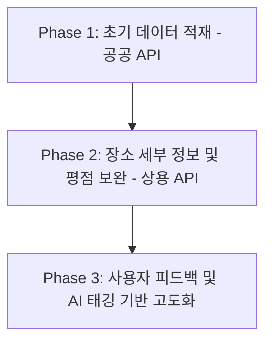

# 데이터셋 확보 및 DB 구축 전략 (Data Acquisition & DB Strategy)

이 문서는 **"Lock & Spin"** 서비스의 핵심 엔진인 여행지 DB (`Place` 테이블)를 구축하고 고도화하기 위한 데이터셋 확보 전략을 정의합니다.

---

## 1. 단계별 데이터 확보 로드맵

초기 서비스 검증(PoC) 단계부터 실제 상용화 단계까지 안정적으로 데이터를 확보하기 위해 **3단계 전략**을 취합니다.



---

## 2. 데이터 소스 및 수집 전략

### 2.1. 한국관광공사 국문 관광정보 서비스 (TourAPI 4.0)
* **적합성**: 대한민국 전국 단위의 관광명소, 문화시설, 축제/행사, 여행 코스, 레포츠, 숙박, 쇼핑, 음식점 정보 제공.
* **수집 방법**: Open API를 통한 배치(Batch) 다운로드 및 DB 동기화.
* **주요 수집 필드**:
  * 콘텐츠 ID, 장소명, 주소, 위도(mapy), 경도(mapx)
  * 대표 이미지 URL (firstimage)
  * 관광 타입 (관광지, 맛집, 숙박 등)
  * 개요/설명글

### 2.2. 상용 로컬 API (Kakao Local / Naver Search API)
* **적합성**: 최신 음식점 및 카페 데이터 확보, 최신 영업 상태 및 정밀 위치 매핑에 유용.
* **수집 방법**: 
  * TourAPI에서 획득한 장소명을 기반으로 Kakao/Naver API에 검색 쿼리를 전송하여 추가 정보 매핑.
* **주요 수집 필드**:
  * 실시간 영업 시간 및 휴무일 정보
  * 블로그 및 방문자 리뷰 개수 (인기 점수 계산용)
  * 상세 카테고리 (분식, 양식, 카페 등)

---

## 3. 데이터 정제 및 테마 태깅 전략 (Data Enhancement)

추천 엔진이 사용자의 세부 취향(#힐링, #액티비티, #인스타감성 등)을 매칭하려면 단순 카테고리를 넘어선 **테마 태그(Theme Tags)**가 필수적입니다.

### 3.1. LLM(대형 언어 모델)을 활용한 자동 태깅 (AI Tagging)
* **방식**: TourAPI의 장소 설명 텍스트와 Kakao/Naver의 상세 카테고리를 LLM(예: GPT, Gemini)에 프롬프트로 전달하여 분류 및 태그를 자동 생성합니다.
* **프롬프트 예시**:
  ```text
  장소명: "안목해변 카페거리"
  설명: "강릉 바다를 바라보며 커피를 즐길 수 있는 유명한 거리로, 경치가 아름답고 힐링하기 좋습니다."
  
  [Task]: 위 정보를 분석하여 적절한 태그 3~5개를 해시태그 목록 [#힐링, #액티비티, #감성, #가족, #자연, #데이트] 중에서 골라 JSON 배열 형태로 출력해줘.
  ```

### 3.2. 웹 크롤링 및 텍스트 마이닝
* **방식**: 블로그 리뷰나 SNS에서 해당 장소와 함께 자주 언급되는 키워드(예: "데이트 코스로 추천", "아이와 가기 좋은")를 수집하여 키워드 빈도수에 기반한 태그를 생성합니다.

---

## 4. SQLite 초기 DB 적재 파이프라인 (Migration Pipeline)

Django 백엔드가 구동될 때 데이터가 미리 채워져 있도록 파이썬 스크립트를 통한 **DB 마이그레이션 파이프라인**을 설계합니다.

```python
# C:\Users\SSAFY\.gemini\antigravity\scratch\data_loader.py (가상의 데이터 수집 및 적재 파이프라인 구조 예시)
import requests
import sqlite3

def fetch_tourapi_data():
    # TourAPI 호출 및 원시 데이터 정제 로직
    pass

def enrich_with_kakao_api(place_name):
    # Kakao API 활용 좌표 및 상세 정보 고도화
    pass

def save_to_sqlite():
    # Django Model 또는 sqlite3 라이브러리를 활용해 Place 테이블에 적재
    pass
```

---


