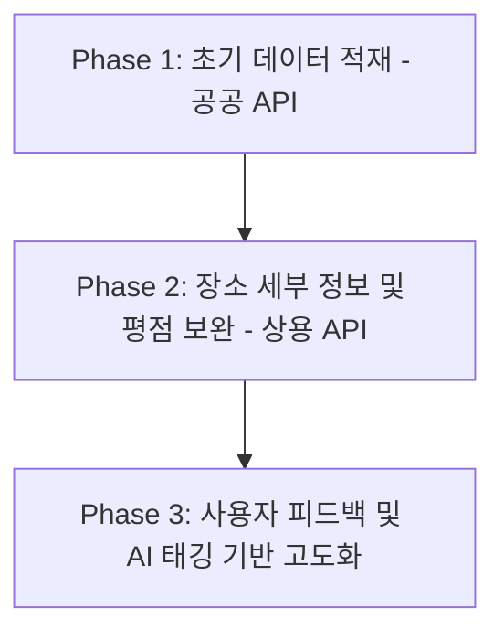

# 데이터셋 확보 및 DB 구축 전략 (Data Acquisition & DB Strategy)

이 문서는 **"Lock & Spin"** 서비스의 핵심 엔진인 여행지 DB (`Place` 테이블)를 구축하고 고도화하기 위한 데이터셋 확보 전략을 정의합니다.

---

## 1. 단계별 데이터 확보 로드맵

초기 서비스 검증(PoC) 단계부터 실제 상용화 단계까지 안정적으로 데이터를 확보하기 위해 **3단계 전략**을 취합니다.



---

## 2. 데이터 소스 및 실시간 수집 전략 (Hybrid Approach)

초기 기획과 달리, 무거운 공공 데이터를 전부 배치(Batch)로 다운로드하는 방식의 한계를 극복하기 위해 **On-the-fly (실시간 수집) 하이브리드 아키텍처**를 구현했습니다.

### 2.1. 자체 DB 기반 1차 스코어링
* **적합성**: AI가 제안한 키워드(Blueprint)를 바탕으로, 내부 SQLite DB에 이미 적재된 `Place` 데이터들을 우선적으로 쿼리합니다.
* **로직**: `구/동 일치 여부`, `앵커 포인트와의 거리`, `유저 취향(veto, preference)`을 종합한 **동적 스코어링 엔진**을 거쳐 최적의 장소를 1차로 선별합니다.

### 2.2. 상용 로컬 API 실시간 보완 (Kakao Local API)
* **적합성**: 특정 지역이나 세부 키워드에 대해 내부 DB 결과가 없거나 부족할 때 즉시 발동하는 Fallback 메커니즘.
* **수집 방법**: 
  * 검색 쿼리(`지역명 + 카테고리`)를 **카카오 로컬 API**로 전송.
  * 결과를 받아와 실시간으로 `Place` 테이블에 Insert 후, 스코어링을 거쳐 유저에게 즉시 반환.
* **장점**: 항상 최신의 영업 정보와 실존하는 장소만 추천되어 AI의 **할루시네이션(환각)을 100% 방지**합니다.

### 2.3. 실시간 행사/팝업 (Naver Search API)
* **적합성**: 전시회, 팝업스토어, 축제 등 기간 한정 데이터 수집.
* **수집 방법**: AI 테마에 '팝업'이나 '전시'가 포함된 경우, **네이버 지역 검색 API**를 찔러 현재 진행 중인 최신 핫플레이스를 가져와 슬롯에 꽂아 넣습니다.

---

## 3. 데이터 정제 및 테마 태깅 전략 (Data Enhancement)

추천 엔진이 사용자의 세부 취향(#힐링, #액티비티, #인스타감성 등)을 매칭하려면 단순 카테고리를 넘어선 **테마 태그(Theme Tags)**가 필수적입니다.

### 3.1. 하이브리드 AI 태깅 (LLM 기반)
* **방식**: 카카오/네이버 API에서 긁어온 원시 데이터(상호명, 카테고리 등)를 그대로 쓰지 않고, **Gemini 3.5 Flash**를 활용해 감성 태그를 동적으로 추출 및 부여합니다.

---

## 4. SQLite 초기 DB 적재 파이프라인 (Migration Pipeline)

Django 백엔드가 구동될 때 데이터가 미리 채워져 있도록 파이썬 스크립트를 통한 **DB 마이그레이션 파이프라인**을 설계합니다.

```python
# C:\Users\SSAFY\.gemini\antigravity\scratch\data_loader.py (가상의 데이터 수집 및 적재 파이프라인 구조 예시)
import requests
import sqlite3

def fetch_tourapi_data():
    # TourAPI 호출 및 원시 데이터 정제 로직
    pass

def enrich_with_kakao_api(place_name):
    # Kakao API 활용 좌표 및 상세 정보 고도화
    pass

def save_to_sqlite():
    # Django Model 또는 sqlite3 라이브러리를 활용해 Place 테이블에 적재
    pass
```

---


