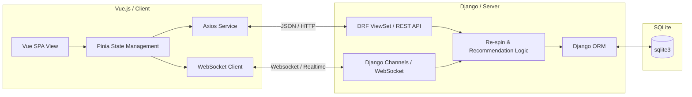

# 프로젝트 설계서 (Project Design)

이 문서는 AI 기반 맞춤형 여행 코스 추천 서비스 **"Lock & Spin"**의 시스템 아키텍처와 데이터베이스(DB) 스키마 설계를 기술합니다.

---

## 1. 시스템 아키텍처 (System Architecture)

본 프로젝트는 단일 DB(SQLite)를 사용하며 백엔드(Django REST Framework)와 프론트엔드(Vue.js)가 분리된 구조입니다. 공동 플래닝(실시간 동기화)을 위해 WebSocket 기반 통신 채널을 추가로 정의합니다.



---

## 2. 데이터베이스 스키마 설계 (DB Schema)

SQLite를 기반으로 한 관계형 데이터 모델 구조입니다. 공동 플래닝 지원을 위해 멤버 공유 관리 모델이 도입되었습니다.

### 2.1. ERD (Entity Relationship Diagram)

```mermaid
erDiagram
    USER ||--oQ USER_PREFERENCE : "has"
    USER ||--oQ TRAVEL_COURSE : "creates"
    TRAVEL_COURSE ||--|{ COURSE_DETAIL : "contains"
    PLACE ||--o{ COURSE_DETAIL : "referenced in"
    USER ||--o{ USER_VETO_CATEGORY : "avoids"
    TRAVEL_COURSE ||--o{ COURSE_MEMBER : "shared with"
    USER ||--o{ COURSE_MEMBER : "participates in"
    USER ||--o{ COMMUNITY_ARTICLE : "writes"
    TRAVEL_COURSE ||--o{ COMMUNITY_ARTICLE : "linked to"
    USER ||--o{ COMMUNITY_COMMENT : "writes"
    COMMUNITY_ARTICLE ||--o{ COMMUNITY_COMMENT : "has"

    USER {
        int id PK
        string username
        string email
        string password
    }

    USER_PREFERENCE {
        int id PK
        int user_id FK
        string preferred_themes "Comma-separated list"
        string preferred_pace "slow | medium | fast"
    }

    USER_VETO_CATEGORY {
        int id PK
        int user_id FK
        string category_code "Categories user dislikes"
    }

    PLACE {
        int id PK
        string name
        string category "restaurant | cafe | spot | activity"
        string themes "Comma-separated themes"
        double latitude
        double longitude
        string address
        string description
        string image_url
    }

    TRAVEL_COURSE {
        int id PK
        int user_id FK "Owner/Creator"
        string title
        string destination
        date start_date
        int duration_days
        datetime created_at
    }

    COURSE_MEMBER {
        int id PK
        int course_id FK
        int user_id FK
        string role "editor | viewer"
        datetime joined_at
    }

    COURSE_DETAIL {
        int id PK
        int course_id FK
        int place_id FK
        int day_number "1, 2, 3..."
        int sequence "order of the day"
        boolean is_locked "default: false"
    }

    COMMUNITY_ARTICLE {
        int id PK
        int user_id FK "Author"
        int course_id FK "Optional link to travel course"
        string title
        string content
        datetime created_at
    }

    COMMUNITY_COMMENT {
        int id PK
        int article_id FK
        int user_id FK "Author"
        string content
        datetime created_at
    }
```

### 2.2. 테이블 상세 정의

#### 1) `User` (사용자 정보)
* Django 기본 Auth User 모델 또는 커스텀 User 모델 상속.

#### 2) `UserPreference` (사용자 성향 및 기본 선호)
* 사용자의 여행 스타일 및 페이스 정보를 기록하는 1:1 관계 테이블.

#### 3) `UserVetoCategory` (사용자 기피 카테고리)
* 사용자가 필터링(비토)하려는 특정 카테고리를 저장해 두는 1:N 관계 테이블.

#### 4) `Place` (여행지 정보 마스터)
* 관광명소, 맛집, 카페 등 모든 목적지 정보를 담는 테이블.
* 위도(`latitude`)와 경도(`longitude`) 정보를 통해 지도 시각화 및 경로 계산을 수행합니다.

#### 5) `TravelCourse` (여행 계획 마스터)
* 사용자가 생성하거나 수정 중인 메인 여행 계획.

#### 6) `CourseMember` (공동 플래닝 멤버 목록)
* 특정 여행 계획(`TravelCourse`)에 참가해 공동으로 편집하거나 읽을 수 있는 사용자 매핑 테이블.
* **`role`**: `editor`(편집 권한 있음), `viewer`(읽기 권한만 있음) 구분.

#### 7) `CourseDetail` (상세 일정 및 Lock 상태)
* 특정 일정(Day N)의 N번째 순서(시간대)에 위치한 여행지 정보를 관리.
* **`is_locked`**: 슬롯 고정 여부를 기록하는 핵심 필드.

#### 8) `CommunityArticle` (여행 커뮤니티 게시글)
* 사용자가 자유롭게 남기는 여행 후기 및 팁 게시글.
* 선택적으로 자신이 작성한 `TravelCourse`를 연동하여 조회수 및 코스 공유를 유도할 수 있습니다.

#### 9) `CommunityComment` (게시글 댓글)
* 특정 게시글에 달린 사용자들의 댓글 테이블.

---

## 3. 핵심 기능 동작 메커니즘 설계

### 3.1. 하이브리드 AI 추천 엔진 및 동적 라우팅 (Hybrid Routing)
1. **AI 블루프린트 기획 (Gemini 3.5 Flash)**: 유저의 입력(지역, 테마)을 바탕으로 구체적인 장소가 아닌 **카테고리와 태그 중심의 일정 뼈대(Blueprint)**를 생성하여 환각(Hallucination)을 원천 차단합니다.
2. **동적 스코어링 엔진 매핑**: 
   * AI가 제안한 뼈대를 실제 장소에 끼워 넣기 위해 내부 DB를 쿼리합니다.
   * `구/동 일치 여부`, `앵커 포인트(확정된 장소)와의 거리`, `유저 비토 카테고리(Veto) 제외` 등을 계산해 최적의 후보를 선정합니다.
3. **실시간 API 보완 (Fallback)**:
   * 내부 DB에 적합한 장소가 없거나, '팝업/전시' 같은 실시간 정보가 필요할 경우 즉각적으로 **Kakao Local API** 및 **Naver Search API**를 호출하여 최신 실존 장소 데이터를 확보 후 렌더링합니다.
4. **소셜 스핀 및 실시간 동기화 (WebSocket Sync)**:
   * Re-spin 및 Lock 상태 변경 시 백엔드에 즉시 저장하고, 해당 코스에 참여 중인 모든 공동 멤버(`CourseMember`)의 WebSocket 채널을 통해 변경된 슬롯 상태를 브로드캐스트하여 화면을 실시간 업데이트합니다.
